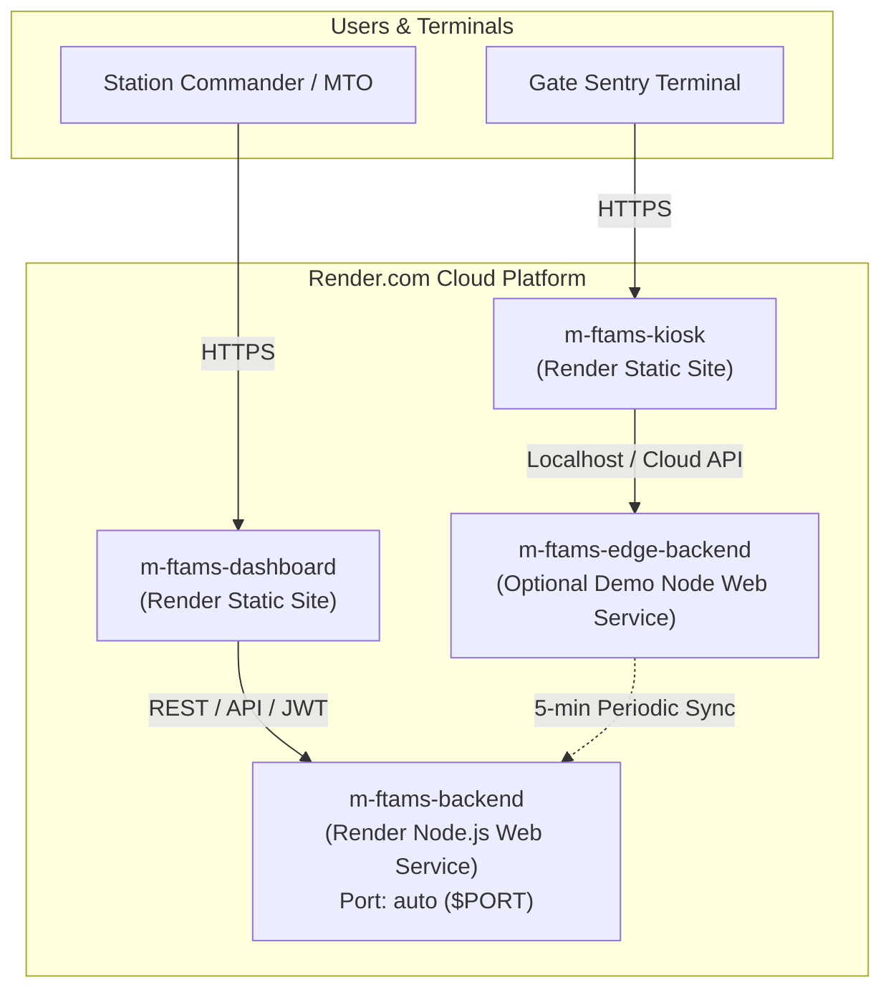

# Deploying M-FTAMS to Render.com

This guide provides instructions for deploying the **M-FTAMS (Military Fleet Transportation & Access Management System)** to [Render.com](https://render.com).

---

## 🏛️ Deployment Architecture on Render

---

## 🚀 Option 1: One-Click Blueprint Deployment (Recommended)

Render Blueprints allow you to deploy the entire multi-service stack with a single click using the included [`render.yaml`](./render.yaml).

### Steps:
1. **Push your repository** to GitHub or GitLab.
2. Go to the [Render Dashboard](https://dashboard.render.com/).
3. Click **"New"** (top right) → **"Blueprint"**.
4. Connect your Git repository containing `render.yaml`.
5. Render will detect the 4 services:
   - `m-ftams-backend` (Web Service)
   - `m-ftams-dashboard` (Static Site)
   - `m-ftams-kiosk` (Static Site)
   - `m-ftams-edge-backend` (Web Service)
6. Click **"Apply"**. Render will automatically build and launch all services in order.

---

## 🛠️ Option 2: Manual Service Creation

If you prefer to configure each service manually in the Render web interface:

### 1. Central Backend (Node.js Web Service)
1. In Render Dashboard, click **New +** → **Web Service**.
2. Connect your Git repository.
3. Configure settings:
   - **Name:** `m-ftams-backend`
   - **Root Directory:** `backend`
   - **Environment:** `Node`
   - **Build Command:** `npm install && npm run build`
   - **Start Command:** `npm start`
   - **Plan:** Free or Starter
   - **Health Check Path:** `/health`
4. In **Environment Variables**, add:
   - `NODE_ENV`: `production`
   - `JWT_SECRET`: *(Click "Generate" or provide a secure 32+ char secret)*
   - `HMAC_MASTER_KEY`: *(Click "Generate" or provide master key)*
5. Click **Create Web Service**. Note your backend URL (e.g. `https://m-ftams-backend.onrender.com`).

---

### 2. Commander & MTO Dashboard (Static Site)
1. In Render Dashboard, click **New +** → **Static Site**.
2. Connect the same Git repository.
3. Configure settings:
   - **Name:** `m-ftams-dashboard`
   - **Root Directory:** `frontend-dashboard`
   - **Build Command:** `npm install && npm run build`
   - **Publish Directory:** `dist`
4. In **Redirects / Rewrites**, add:
   - **Type:** `Rewrite`
   - **Source:** `/*`
   - **Destination:** `/index.html`
   *(This is also pre-configured via `frontend-dashboard/public/_redirects`)*
5. In **Environment Variables**, add:
   - `VITE_API_URL`: `https://m-ftams-backend.onrender.com/api/v1`
   *(Replace with your actual backend URL from Step 1)*
6. Click **Create Static Site**.

---

### 3. Sentry Gate Kiosk (Static Site)
1. In Render Dashboard, click **New +** → **Static Site**.
2. Connect the Git repository.
3. Configure settings:
   - **Name:** `m-ftams-kiosk`
   - **Root Directory:** `frontend-kiosk`
   - **Build Command:** `npm install && npm run build`
   - **Publish Directory:** `dist`
4. In **Redirects / Rewrites**, add:
   - **Type:** `Rewrite`
   - **Source:** `/*`
   - **Destination:** `/index.html`
5. In **Environment Variables**:
   - `VITE_EDGE_API_URL`: `http://localhost:3001` (for on-premise hardware loopback) or your deployed edge backend URL.
6. Click **Create Static Site**.

---

### 4. Edge Backend Node (Optional Demo Web Service)
1. In Render Dashboard, click **New +** → **Web Service**.
2. Connect the Git repository.
3. Configure settings:
   - **Name:** `m-ftams-edge-backend`
   - **Root Directory:** `edge-backend`
   - **Build Command:** `npm install && npm run build`
   - **Start Command:** `npm start`
   - **Health Check Path:** `/health`
4. In **Environment Variables**:
   - `NODE_ENV`: `production`
   - `EDGE_ID`: `GATE-04`
   - `CENTRAL_URL`: `https://m-ftams-backend.onrender.com`
5. Click **Create Web Service**.

---

## ⚙️ Environment Variables Summary

| Service | Variable Name | Required | Default / Example | Purpose |
| :--- | :--- | :---: | :--- | :--- |
| **Backend** | `PORT` | Auto | Render assigned | Internal HTTP port |
| **Backend** | `NODE_ENV` | Yes | `production` | Production runtime flag |
| **Backend** | `JWT_SECRET` | Yes | *(auto-generated)* | JWT signing secret |
| **Backend** | `HMAC_MASTER_KEY`| Yes | *(auto-generated)* | Token & Audit cryptographic key |
| **Dashboard** | `VITE_API_URL` | Yes | `https://...onrender.com/api/v1` | Backend API URL |
| **Kiosk** | `VITE_EDGE_API_URL`| Optional | `http://localhost:3001` | Edge backend API URL |
| **Edge** | `CENTRAL_URL` | Yes | `https://...onrender.com` | Central server sync target |
| **Edge** | `EDGE_ID` | Yes | `GATE-04` | Sentry post gate identifier |

---

## 🔐 Default Access Credentials

Default password for all built-in test accounts: **`password123`**

| Role | Username | Description |
| :--- | :--- | :--- |
| **ADMIN** | `admin` | System Administration & User Management |
| **MTO** | `mto` | Movement Control Officer — Requisition approval & Token issuance |
| **COMMANDER** | `commander` | Station Commander — Read-only fleet situational awareness |
| **SENTRY** | `sentry_main` | Gate Duty Officer — Inbound/Outbound RFID handshake |
| **DRIVER** | `driver_rakesh` | Driver personnel credential |

---

## 🔍 Verification & Health Checks

After deployment completes:
- **Backend Health:** `GET https://your-backend.onrender.com/health` (Should return `{"status":"HEALTHY"}`)
- **Backend Prometheus Metrics:** `GET https://your-backend.onrender.com/metrics`
- **Dashboard UI:** Open `https://your-dashboard.onrender.com` and log in with `mto` / `password123`.
